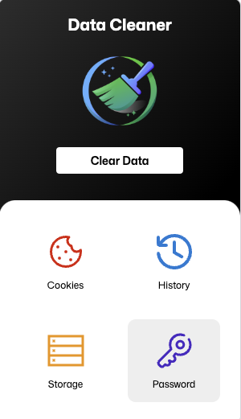

# Data Cleaner Extension Documentation

### Table of Contents
1. Introduction
2. Installation
3. Use case
4. Usage  
    4.1.  Cleaning Cookies  
    4.2.  Clearing Local Storage  
    4.3.  Erasing Browsing History  
5. Conclusion
6. Screenshot
7. Feature Updates

## 1. Introduction
The Data Cleaner Extension for Ulaa Browser is a tool designed to enhance your privacy and manage your cookies, localstorage, and history effectively. 
It has a feature for domain-based filtering and deletion. 
> It allows you to target specific websites or domains for cleaning cookies, local storage, and history.

### The Importance of Clearing Cookies, Storage, and History

**Cookies:** Cookies are small text files that websites store on your device to remember your preferences and login information. While they can be useful, they can also be used to track your online activities. Clearing cookies regularly helps protect your online privacy and prevents advertisers from building detailed profiles about your behavior.

**Local Storage:** Websites use local storage to store data on your device, which can include sensitive information. Clearing local storage ensures that websites do not retain your personal data without your consent.

**Browsing History:** Your browsing history contains a record of the websites you've visited and the searches you've made. Clearing your history helps maintain your privacy and keeps your online activities confidential.

#### - Preventing Cross-Site Tracking
Clearing cookies can help prevent cross-site tracking, where data is shared across different websites to create a comprehensive profile of your online behavior. This type of tracking can be invasive and compromise your privacy.

#### - Protecting Your Credentials
If you're using a shared computer or a public device, clearing cookies and browsing history helps ensure that your login credentials and sensitive information are not accessible to others.

#### - Customized Browsing
Clearing cookies can also have the benefit of allowing you to start with a clean slate when you revisit websites. This can be useful when you want to see content as if you were a new visitor or if you've encountered website issues due to corrupted or outdated cookies.

> This documentation will help you understand how to install, configure, and use this extension to keep your browser clean and protect your online privacy.

## 2. Installation
To install the extension, follow these steps:

1. Open your Ulaa extensions page (or) [ulaa://extensions/](ulaa://extensions/).
2. Turn on the developer mode.
3. Select Load unpacked and select the root directory of the extension.
<!-- 4. Locate the extension in the search results and click on it.
5. Click the "Add to Chrome" button.
6. In the pop-up window, click "Add Extension." -->

The extension will be added to your browser, and you'll find its icon in the Chrome toolbar.

## 3. Use Case 
Use Case for cookie deletion using “DATA CLEANER EXTENSION”

    Consider a scenario where you have logged in to multiple websites through the course of your tasks, and at the end of the day, you need to log out. Typically, clearing the stored cookies on your browser will log you out of these websites. But, doing so will also log you out of ‘ALL’ of those sessions. If you wanted to logout of some sessions and retains some sessions, you would be unable to do that, because conventional cookie clearing extensions/tools will clear ‘ALL’ the stored cookies on your system. There is no way to choose which cookies you’d want to keep and what to remove. This is where ‘DATA CLEANER EXTENSION’ plays its part. 

This extension allows you to clear cookies selectively, by virtue of its domain-based filtering. You can mention the domains whose cookies you want to remove, and the extension will delete all the cookies from that specific domain and retain the rest.

## 4. Usage
### 4.1. Cleaning Cookies
1. Click the extension icon in the Ulaa toolbar.
2. Select **"Cookies"** from cards.
3. It will show 2 options to clear `All` or `Specific domain`.
4. To clear all the cookies in the browser select `All` and Click `Clear now` Button.
4. To clear specific cookies filtering by domain select `Specific Domain` 
5. This will show a select field with list of domains. You can select one or more domain(s).
6. Once you selected the domain it will list the cookies stored by the specific domain(s).
7. Select the cookies that you want to delete and click `Clear Now`.
8. A dialog box will appear, asking if you want to proceed. `Confirm` to delete the cookies.

### 4.2. Erasing Browsing History
1. Click the extension icon in the Ulaa toolbar.
2. Select **"History"** from cards.
3. It will show 3 options to clear `All`, `Specific domain` and `Date`.
4. To clear all the history in the browser select `All` and Click `Clear now` Button.
4. To clear specific history filtering by domain select `Specific Domain` 
5. This will show a select field with list of domains. You can select one or more domain(s).
6. Once you selected the domain it will list the history data for the specific domain(s).
7. Select the histories that you want to delete and click `Clear Now`.
4. To clear specific history filtering by date select `Date` 
6. Then select the from date and ethe end date, it will list the history data for the between dates.
7. Select the histories that you want to delete and click `Clear Now`.
8. A dialog box will appear, asking if you want to proceed. `Confirm` to delete the cookies.

### 4.3. Clearing Local Storage
1. Click the extension icon in the Ulaa toolbar.
2. Select **"Storage"** from cards.
3. It will show 2 options to clear `All` or `Specific domain`.
4. To clear all the localstorage date in the browser localstorage select `All` and Click `Clear now` Button.
4. To clear specific localstorage data filtering by domain select `Specific Domain` 
5. Enter the domain name and click `Clear Now`.
6. A dialog box will appear, asking if you want to proceed. `Confirm` to delete the cookies.

## 5. Conclusion
The Data Extension is a valuable tool for maintaining your online privacy and keeping your browser clean and efficient. By following the guidelines and instructions in this documentation, you can make the most of the extension's features and protect your digital privacy while browsing the web.

## 6. Screenshot

## 7. Feature Updates. 
**Password Manager**: A tool to manage your saved password.